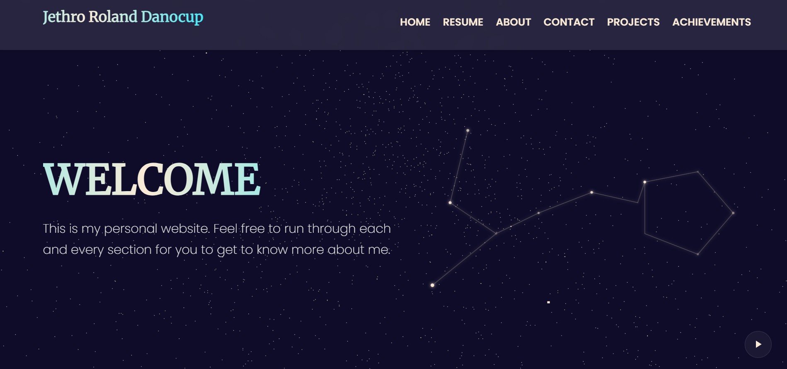

# Jethro Roland Danocup - Personal Portfolio Website


### [View Live Demo](https://jethroishere.github.io/portfolio-danocup/) &nbsp;👈
---

## 📖 About The Project

This repository contains the source code for my personal portfolio website. It is a fully responsive, multi-page static site designed from the ground up to showcase my skills, projects, and achievements as a Computer Science student majoring in Artificial Intelligence.

The design is centered around a modern, celestial "outer space" theme, utilizing a **glassmorphism** aesthetic, dynamic animations, and interactive elements to create an engaging user experience.

---

## ✨ Key Features

-   **Fully Responsive Design:** Adapts seamlessly to all screen sizes, from mobile phones to high-resolution desktops.
-   **Comprehensive Multi-Page Layout:** Includes six distinct pages:
    -   **Home:** A welcoming landing page with an animated hero section and a summary of the portfolio's key sections.
    -   **About:** A detailed personal introduction, including a "My Philosophy" section and personal interests.
    -   **Resume:** A professional, well-structured digital resume with a "Download CV" option.
    -   **Projects:** An organized gallery showcasing collaborative, web, and Python-based projects.
    -   **Achievements:** An interactive timeline displaying all certificates and awards.
    -   **Contact:** A modern contact page with direct info and a functional email form.
-   **Interactive Homepage:** Features a dynamic background with **Three.js** particles and a custom animated constellation graphic created with the **HTML5 Canvas API**.
-   **On-Scroll Animations:** Content sections gracefully fade and slide into view as the user scrolls, powered by the Intersection Observer API.
-   **Cross-Page Background Music:** An optional background music player with user controls that persists playback state and time across all pages using `localStorage`.

---

## 🛠️ Tech Stack

This project was built using core front-end technologies, with no external frameworks.

-   **HTML5:** For semantic structure and content.
-   **CSS3:** For all styling, including:
    -   Flexbox & Grid for responsive layouts
    -   Custom Animations & Transitions
    -   Glassmorphism effects (`backdrop-filter`)
-   **JavaScript (ES6+):** For all dynamic functionality:
    -   DOM Manipulation
    -   HTML5 Canvas API for the constellation animation
    -   Intersection Observer API for scroll animations
    -   `localStorage` for persistent music playback
-   **Three.js:** A lightweight library used for the animated 3D particle background on the homepage.

---

## 🚀 Getting Started

To run this project locally:

1.  Clone the repository:
    ```sh
    git clone [https://github.com/JethroIsHere/your-portfolio-repo-name.git](https://github.com/JethroIsHere/your-portfolio-repo-name.git)
    ```
    2.  Navigate to the project directory:
    ```sh
    cd your-portfolio-repo-name
    ```
3.  Open the `index.html` file in your favorite web browser.

---

## 👤 Author & Contact

**Jethro Roland Danocup**

-   **GitHub:** [@JethroIsHere](https://github.com/JethroIsHere)
-   **Facebook:** [Jethro Roland Danocup](https://www.facebook.com/jethro.roland.danocup)
-   **Instagram:** [@___ro__n_](https://www.instagram.com/___ro__n_/)

*Last updated: September 15, 2025*